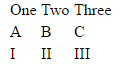
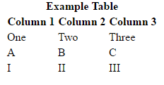
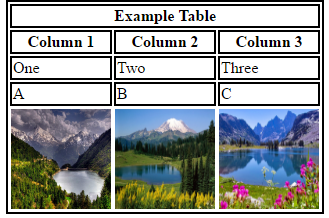

# \<tr\>

*HTML element: table row*

The \<tr\> tag is used to create a table row, so it is used as part of the table creation structure. 
The \<tr\> tag must be a direct child of one of the following element tags: \<table\>, \<thead\>, \<tfoot\> or \<tbody\>.
In each case, the \<tr\> tag defines the space for creating the cells within a table.
A table row can contain one cell or more, so the \<tr\> tag contains one or more \<th\> (table header cell)
or \<td\> (table data cell) elements. 

## Browser support

All browsers support the \<tr\>.

##Attributes
The \<tr\> element takes all the global html attributes, which are attributes that are common and may be specified on all html elements. 
The list of these attributes is:

<li>accesskey
<li>class
<li>contenteditable
<li>contextmenu
<li>dir
<li>draggable
<li>dropzone
<li>hidden
<li>id
<li>lang
<li>spellcheck
<li>style
<li>tabindex
<li>title
<li>translate

## Example 1

A simple table consisting of 3 rows and 3 cells

```
  <table>
        <tr>
           <td>One</td>
           <td>Two</td>
           <td>Three</td>
        </tr>
        <tr>
           <td>A</td>
           <td>B</td>
           <td>C</td>
        </tr>
          <tr>
           <td>I</td>
           <td>II</td>
           <td>II</td>
        </tr>
  </table>
  
```




## Example 2

The same table as above, with a header section consisting of two rows, the first one used as a table title, and the second one
used for column titles. 
Note that the \<thead\> automatically gets rendered at the top of the table, no matter where the \<thead\> section falls within the \<table\> tag, wheter at the top, the bottom, or anywhere in between.

```
    <table >
        <tr>
           <td>One</td>
           <td>Two</td>
           <td>Three</td>
        </tr>
        <tr>
           <td>A</td>
           <td>B</td>
           <td>C</td>
        </tr>
          <tr>
           <td>I</td>
           <td>II</td>
           <td>III</td>
        </tr>
        <thead>
        	<tr>
        		<th colspan="3">Example Table</th>
        	</tr>
        	<tr>
        		<th>Column 1</th>
        		<th>Column 2</th>
        		<th>Column 3</th> 
        	</tr>       	
        </thead>
  </table>
```


## Example 3 - Complex

This is an example of a slightly more complex table with \<tr\> elements included

```
    <table   style="border: 2px solid black">
        <thead  style="border: 2px solid black">
        	<tr>
        		<th colspan="3"   style="border: 2px solid black">Example Table</th>
        	</tr>
        	<tr>
        		<th   style="border: 2px solid black">Column 1</th>
        		<th   style="border: 2px solid black">Column 2</th>
        		<th   style="border: 2px solid black">Column 3</th> 
        	</tr>       	
        </thead>
        <tbody   style="border: 2px solid black">
              <tr>
                 <td  style="border: 2px solid black" spellcheck="true">One</td>
                 <td  style="border: 2px solid black" spellcheck="true">Two</td>
                 <td  style="border: 2px solid black" spellcheck="true">Three</td>
              </tr>
              <tr>
                 <td  style="border: 2px solid black" spellcheck="True">A</td>
                 <td  style="border: 2px solid black" spellcheck="true">B</td>
                 <td  style="border: 2px solid black" spellcheck="true">C</td>
              </tr>
                <tr draggable="true" class="highlight">
                 <td><a href="http://www.spyderonlines.com/image.php?pic=images/wallpapers/pic-of-nature/pic-of-nature-6.jpg"></a></td>
                 <td><a href="http://www.spyderonlines.com/image.php?pic=images/wallpapers/pic-of-nature/pic-of-nature-11.jpg"></a></td>
                 <td><a href="http://www.spyderonlines.com/image.php?pic=images/wallpapers/pic-of-nature/pic-of-nature-23.jpg"></a></td>
              </tr>
        </tbody>
  </table>
  
```


## Special Notes

A \<tr\> element's end tag can be ommitted if the \<tr\> element is immediately followed by another \<tr\> element, or if there is
no more content in the parent element.

Normally, the \<tr\> element has as content one or more \<td\> or \<th\> elements, but it is also possible that it contains zero
of these elements, or that it includes script-supporting elements, such as \<script\> or \<template\>, which are elements that are not rendered but used to support scripts, for example to provide some functionality. These would normally be defined either in a separate
sheet, or in a different block within the html document.

The following attributes could previously be used with the \<tr\> tag, but have since been either deprecated or completely become
obsolete in HTML5, the latest version of Hypertext Markup Language, so they should not be used with this tag:

<li>align
<li>bgcolor
<li>char
<li>charoff
<li>valign

